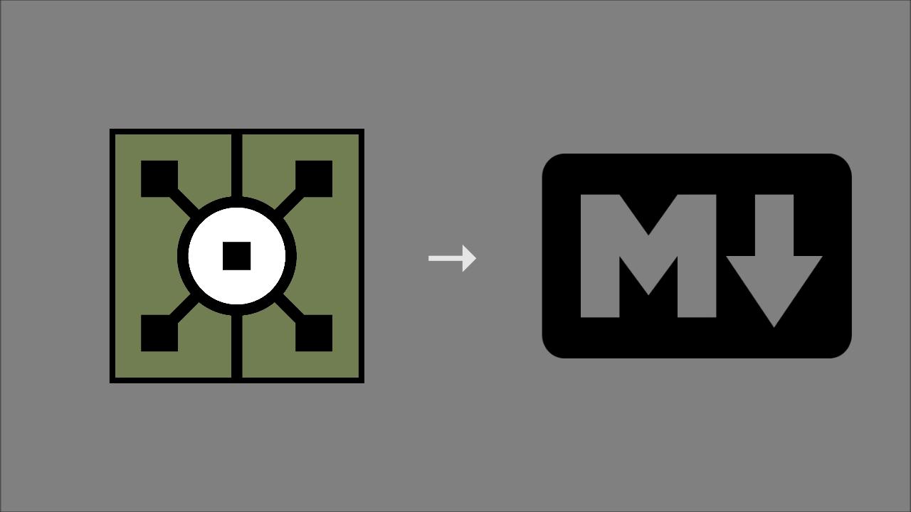
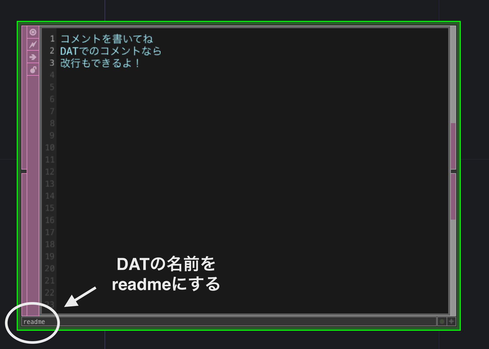
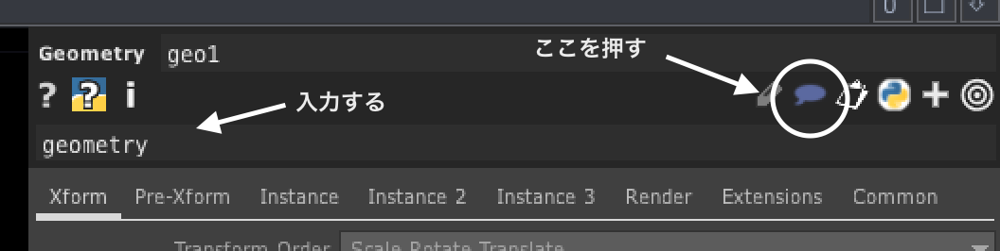
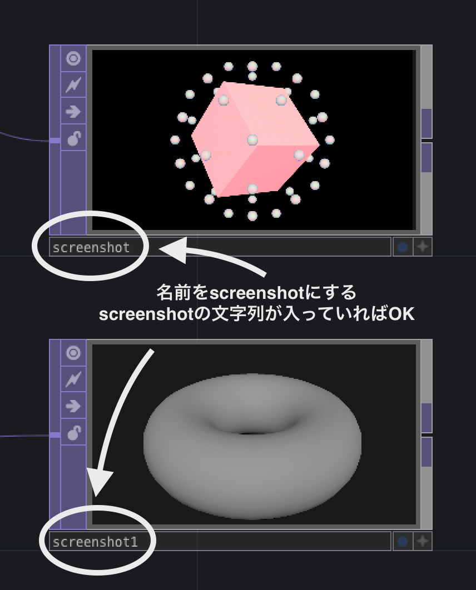

# makeDocumentFromTD

- TouchDesigner のプロジェクトからドキュメント（MarkDown、HTML）を生成するコンポーネント
- コメントの付いたオペレータ、または `readme` と名のついたDATからHeader及び文章、`screenshot`が名前に含まれるTOPをスクリーンショットを取得し、ドキュメントを自動で作成します。

---

## 使い方

### 導入方法

- makeDocumentFromTD.tox をプロジェクトの任意の場所に置く
- ファイル名などをパラメータから設定
- パラメータから `Create` ボタンを押してファイル出力

---

### ルール

#### テキスト

- `readme` という名前のDATを作成

または

- オペレータにコメントを付ける

- ヘッダー名はプロジェクトの階層とオペレータ名から自動生成
- URLは自動的にリンク付け

#### スクリーンショット

- `screenshot` という文字列の入った名前のTOPから画像のスクリーンショットを作成

### 出力方法

- 保存するファイル名、保存先を設定
- Createボタンでドキュメント生成

---

## パラメーター

- Component
  - プロジェクトのオペレータのパス

- file name
  - 出力するドキュメントのファイル名

- File Format
  - Markdown
  - HTML
  - Json

- Output file
  - 出力される拡張子付きファイル名（自動入力）

- Output Folder
  - 出力するフォルダのパス

- Image Format
  - 出力する画像の拡張子

- Create
  - ボタンを押すとドキュメント作成する
